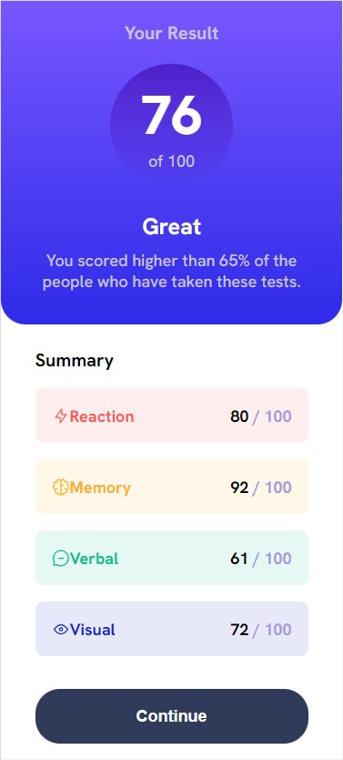
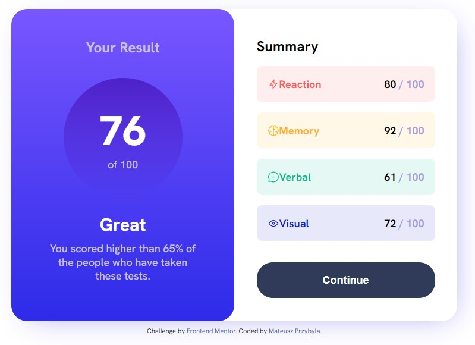

# Frontend Mentor - Results summary component solution

This is a solution to the [Results summary component challenge on Frontend Mentor](https://www.frontendmentor.io/challenges/results-summary-component-CE_K6s0maV). Frontend Mentor challenges help you improve your coding skills by building realistic projects.

## Table of contents

- [Overview](#overview)
  - [Screenshot](#screenshot)
  - [Links](#links)
- [My process](#my-process)
  - [Built with](#built-with)
  - [Useful resources](#useful-resources)
- [Author](#author)

## Overview

### Screenshot

### Links

- Solution URL: https://github.com/mateusz-przybyla/Results-summary-component
- Live Site URL: https://mateusz-przybyla.github.io/Results-summary-component/

## My process

### Built with

- Semantic HTML5 markup
- CSS custom properties
- Flexbox
- Mobile-first workflow

### Useful resources

- [Web Development Bootcamp](https://www.udemy.com/course/the-complete-web-development-bootcamp/?couponCode=KEEPLEARNING) - The Web Development Bootcamp in which I am taking part.
- [MDN Web Docs](https://developer.mozilla.org/en-US/) - My best website which help me understand rules and features about HTML and CSS languages.

## Author

- Frontend Mentor - [@mateusz-przybyla](https://www.frontendmentor.io/profile/mateusz-przybyla)
